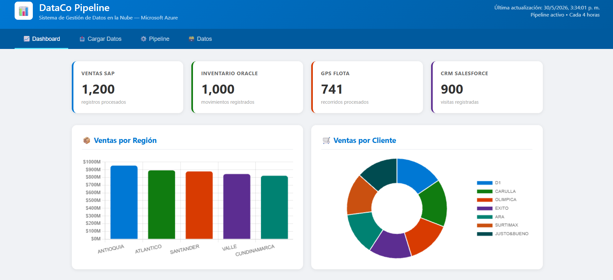
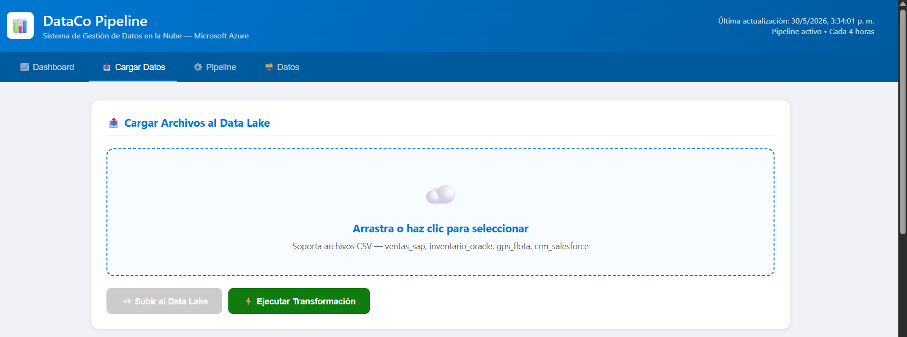

# DataCo Pipeline — Dashboard Web

> Dashboard web para el pipeline de datos en la nube de DataCo, desarrollado como parte del proyecto integrador de Computación en la Nube — Tecnológico de Antioquia 2026-1.

> ⚠️ **Nota:** Los servicios de Azure asociados a este proyecto han sido eliminados tras la entrega del trabajo académico. La página web muestra datos de demostración. Este repositorio se mantiene como evidencia del trabajo realizado.

🌐 **Repositorio:** [https://julianj227.github.io/dataco-web/](https://julianj227.github.io/dataco-web/)

---

## 📋 Descripción

Este dashboard web fue desarrollado como interfaz de usuario para el pipeline de datos de DataCo — una empresa colombiana de distribución con operaciones en 12 departamentos. La aplicación permite cargar archivos CSV desde el navegador, ejecutar transformaciones de limpieza de datos y visualizar los resultados en tiempo real, sin necesidad de acceder al portal de Azure ni tener Power BI instalado.

---

## 🏗️ Arquitectura

```
Usuario (navegador)
        ↓
Dashboard Web — GitHub Pages
(index.html + styles.css + app.js)
        ↓
Flask API — Azure App Service
(Python + SQLAlchemy + Azure SDK)
        ↓
    ┌───┴───┐
    ↓       ↓
Data Lake  Azure SQL
Gen2       Database
(raw/)  (hechos_ventas,
         hechos_inventario,
         hechos_gps,
         hechos_crm)
```

---

## ✨ Funcionalidades

### 📈 Dashboard
- Tarjetas con el total de registros por cada fuente de datos (SAP, Oracle, GPS, Salesforce)
- Gráfica de barras — ventas por región
- Gráfica circular — ventas por cliente
- Gráfica de barras horizontal — ventas por producto
- Gráfica de barras horizontal — recorridos por ruta GPS
- Actualización automática al cargar la página

### 📤 Cargar Datos
- Subida de archivos CSV directamente al Data Lake desde el navegador
- Detección automática del tipo de archivo por nombre:
  - Nombre contiene `sap` o `ventas` → procesa como ventas SAP
  - Nombre contiene `oracle` o `inventario` → procesa como inventario Oracle
  - Nombre contiene `gps` o `flota` → procesa como datos de flota GPS
  - Nombre contiene `crm` o `salesforce` → procesa como CRM Salesforce
- Ejecución de transformaciones bajo demanda
- Barra de progreso durante la subida

### ⚙️ Pipeline
- Diagrama visual del flujo completo del pipeline
- Historial de ejecuciones de Azure Data Factory
- Estado de los servicios Azure en tiempo real

### 🗃️ Datos
- Visualización de las 4 tablas de Azure SQL Database
- Primeros 20 registros por tabla
- Tablas disponibles: hechos_ventas, hechos_inventario, hechos_gps, hechos_crm

---

## 📸 Capturas de pantalla

### Dashboard principal


El dashboard muestra 4 tarjetas KPI con los registros procesados por cada fuente:
- **Ventas SAP:** 1,200 registros procesados
- **Inventario Oracle:** 1,000 movimientos registrados
- **GPS Flota:** 741 recorridos procesados
- **CRM Salesforce:** 900 visitas registradas

Incluye 4 gráficas interactivas: ventas por región (Antioquia lidera con ~$950M), ventas por cliente en gráfica donut (D1, Carulla, Olímpica, Éxito, Ara, Surtimax y Justo&Bueno), ventas por producto y recorridos por ruta GPS.

---

### Módulo Cargar Datos


El módulo permite al usuario:
1. Arrastrar o seleccionar archivos CSV desde su computador
2. Subir los archivos directamente al Data Lake de Azure
3. Ejecutar la transformación con un clic

Soporta los 4 tipos de archivo: `ventas_sap`, `inventario_oracle`, `gps_flota` y `crm_salesforce`.

---

## 🛠️ Stack tecnológico

| Tecnología | Uso |
|-----------|-----|
| HTML5 + CSS3 + JavaScript | Frontend del dashboard |
| Chart.js | Gráficas interactivas |
| GitHub Pages | Hosting del frontend |
| Python + Flask | API REST backend |
| Flask-CORS | Manejo de CORS |
| Azure App Service | Hosting de la API |
| Azure Data Lake Gen2 | Almacenamiento de archivos CSV |
| Azure SQL Database | Almacén analítico final |
| Azure SDK for Python | Conexión con Data Lake |
| SQLAlchemy + pyodbc | Conexión con Azure SQL |

---

## 📁 Estructura del repositorio

```
dataco-web/
├── index.html      — Estructura HTML del dashboard
├── styles.css      — Estilos y diseño visual
├── app.js          — Lógica JavaScript y llamadas a la API
└── README.md       — Documentación del proyecto
```

---

## 🔄 Transformaciones de calidad aplicadas

Cuando el usuario ejecuta la transformación, el sistema aplica automáticamente:

**SAP — Ventas:**
- Estandarización de fechas de DD/MM/YYYY a YYYY-MM-DD
- Eliminación de registros duplicados
- Cálculo de columna `valor_total` = cantidad × precio_unitario
- Estandarización de texto a mayúsculas

**Oracle — Inventario:**
- Corrección de códigos de producto (PRD-001 → PROD001)
- Relleno de fechas de vencimiento nulas con "SIN_VENCIMIENTO"
- Estandarización de bodegas y tipos de movimiento

**GPS — Flota:**
- Eliminación de registros con tiempos de entrega negativos
- Relleno de coordenadas nulas con 0
- Relleno de consumo de combustible con el promedio

**Salesforce — CRM:**
- Estandarización de nombres de clientes (múltiples variantes → nombre único)
- Relleno de valores de acuerdo nulos con 0

---

## 🚀 Contexto del proyecto

Este dashboard hace parte del proyecto integrador **"Pipeline de Datos en la Nube — Caso DataCo"** desarrollado para el curso de Computación en la Nube del Tecnológico de Antioquia.

El pipeline completo implementado en Azure incluye:

| Servicio | Función |
|----------|---------|
| Azure Data Lake Storage Gen2 | Almacenamiento raw y curated |
| Azure Data Factory | Orquestación automática cada 4 horas |
| Azure Functions | Transformación automática cada 4 horas |
| Azure SQL Database | Almacén analítico final |
| Flask API (este repo) | Backend del dashboard web |
| Power BI Desktop | Reportes ejecutivos |

---

## 👨‍💻 Autor

**Julian Jimenez**
Estudiante de Tecnología en Sistemas — Tecnológico de Antioquia
Curso: Computación en la Nube 2026-1

---

## 📄 Repositorio del proyecto completo

El proyecto completo con modelo C4, ADRs, notebooks y evidencias está en:
[github.com/JulianJ227/DataCo-Cloud-Pipeline](https://github.com/JulianJ227/DataCo-Cloud-Pipeline)
